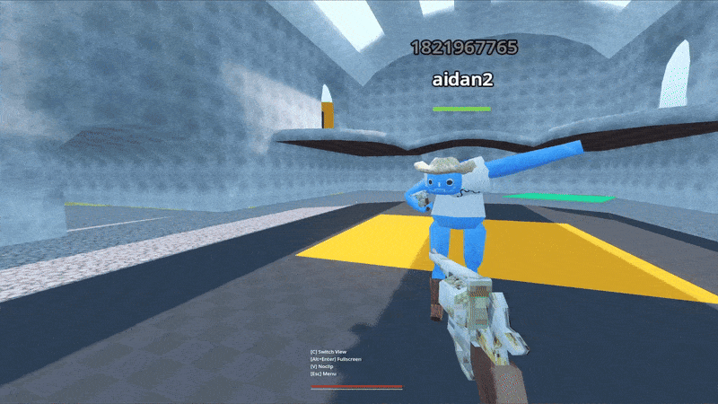
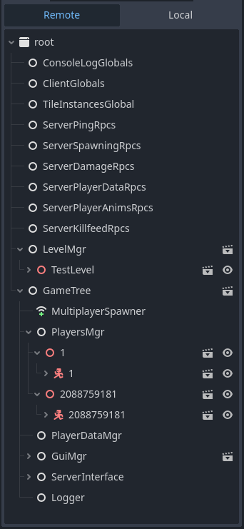

# Multiplayer First Person Shooter Godot 4 Game
Built in Godot 4.4 for teaching the **GodotCon Boston 2025 Multiplayer Basics Workshop**.

This project demonstrates:
- How to connect over the network using Godot's high level multiplayer (ENet Server/Clients, MultiplayerSpawner, MultiplayerSynchronizer).
- Scene Replication (having the scene tree match on all clients, which is needed for MultiplayerSynchronizer to work).
- Using Remote Procedure Call (RPC) functions to share data across the network.
- [Syncing positions and rotations](components/syncing_values) at a lower frequency and lerping between frames, to reduce network bandwidth.
- Storing the game state on the Host, and updating clients with the new game states. See [PlayerDataMgr](components/server_connection/player_data_mgr.gd)
- Using the [Tile Instances](https://gist.github.com/mrcdk/3c22d91a3b4fb784d5df60667a33cf1e) addon to speed up testing.

## Scene Tree Replication
In order for MultiplayerSynchronizer node to work, the scene tree paths for the networked nodes must match across clients.
For example, to sync Player 2088759181's position, the CharacterBody3D on each client must be at the path `root/GameTree/PlayersMgr/2088759181/2088759181`.

